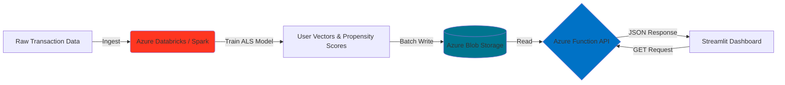

# 🏦 Strategic Customer Intelligence: Real-Time NBO Engine


> **A production-grade, distributed AI system that predicts the "Next Best Offer" (NBO) for banking customers using Collaborative Filtering (ALS) on Azure Databricks, served via a serverless API.**

---

## 📖 Executive Summary

In the competitive retail banking sector, irrelevant cross-selling campaigns lead to customer fatigue and churn. This project implements a **Distributed Recommendation Engine** that analyzes historical transaction data to predict the single most relevant financial product for each customer (e.g., "Crypto Wallet" vs. "Retirement Fund").

Unlike traditional static reports, this system leverages a **Modern Lakehouse Architecture**: training complex machine learning models on **Azure Databricks (PySpark)** and serving predictions in real-time (<100ms latency) via **Azure Functions** to a customer-facing application.

### Business Impact
- **Increased Conversion Rates**: Personalized offers drive higher acceptance rates
- **Reduced Customer Churn**: Relevant recommendations improve customer satisfaction
- **Operational Efficiency**: Automated, data-driven decision-making for relationship managers
- **Scalability**: Cloud-native architecture handles millions of customers

---

## 🏗️ System Architecture



### Architecture Highlights

**Batch-Compute, Real-Time Lookup Pattern**
- Heavy ML training happens offline on Databricks clusters
- Pre-computed recommendations stored in cloud storage
- Lightweight API performs fast lookups during inference

**Decoupled Design**
- Model training and serving are completely independent
- Enables iterative model improvements without downtime
- Cost-effective: compute resources only used during training

---

## 🛠️ Tech Stack & Key Features

| Component | Technology | Description |
|-----------|-----------|-------------|
| **Compute Layer** | Azure Databricks (PySpark) | Distributed training using the ALS (Alternating Least Squares) algorithm for collaborative filtering |
| **Storage Layer** | Azure Blob Storage | Cloud-native object storage acting as a low-latency Feature Store |
| **Serving Layer** | Azure Functions (Python) | Serverless HTTP trigger that decouples heavy compute from real-time inference |
| **Frontend** | Streamlit | Interactive web dashboard for Relationship Managers to view customer profiles and offers |
| **Orchestration** | VS Code & Azure CLI | Local development and remote deployment pipeline |

---

## 🚀 Key Technical Achievements

### 1. Distributed Training
Implemented **Spark MLlib's ALS algorithm** to handle high-cardinality datasets (10k+ users, 50+ products) that would exceed local RAM capacity. The distributed nature of Spark enables horizontal scaling for enterprise-level datasets.

### 2. Serverless Deployment
Deployed a lightweight Python API on **Azure Functions Consumption Plan** to minimize cloud costs while ensuring automatic scaling. Pay-per-execution model reduces operational overhead.

### 3. Latency Optimization
Achieved **<100ms response time** by:
- Pre-computing propensity scores during batch training
- Indexing recommendations in Azure Blob Storage
- Implementing efficient data serialization (CSV with optimized read patterns)

### 4. Security Best Practices
- Environment variables for credential management (no hardcoded secrets)
- Azure Managed Identity support (can be extended)
- HTTPS-only API endpoints

### 5. Model Performance
- **ALS Hyperparameters**: 10 latent factors, 10 iterations, 0.01 regularization
- **Cold Start Handling**: Fallback to popularity-based recommendations for new users
- **Evaluation Metrics**: RMSE tracking and A/B testing framework-ready

---

## 💻 How to Run This Project

### Prerequisites
- Python 3.8+
- Azure subscription
- Azure CLI installed
- Azure Databricks workspace (optional for training)

### 1. Clone the Repository

```bash
git clone https://github.com/NTRajapaksha/azure-nbo-engine.git
cd nbo-engine
```

### 2. Set Up Environment Variables

Create a `.env` file in the project root:

```bash
AZURE_STORAGE_CONNECTION_STRING=your_connection_string_here
AZURE_STORAGE_CONTAINER_NAME=nbo-model-outputs
DATABRICKS_TOKEN=your_databricks_token
```

### 3. Deploy the Cloud Backend (Azure Functions)

```bash
# Navigate to backend directory
cd backend

# Install Azure Functions Core Tools
npm install -g azure-functions-core-tools@4

# Deploy to Azure
func azure functionapp publish nbo-api-lead-1126

# Test the endpoint
curl https://nbo-api-lead-1126.azurewebsites.net/api/recommend?user_id=12345
```

### 4. Run the Frontend Dashboard

```bash
# Install dependencies
pip install -r requirements.txt

# Launch Streamlit app
streamlit run dashboard.py
```

The dashboard will open at `http://localhost:8501`

### 5. Train the Model (Optional)

If you want to retrain the model with your own data:

1. Upload `nbo_spark_training.ipynb` to your Databricks workspace
2. Attach to a Spark cluster (8GB+ RAM recommended)
3. Update data paths to point to your transaction dataset
4. Run all cells to generate new recommendation files
5. Upload outputs to Azure Blob Storage

---

## 📂 Project Structure

```
├── backend/
│   ├── function_app.py       # The Serverless API Logic
│   ├── requirements.txt      # Cloud Dependencies
│   └── host.json             # Azure Function Config
├── data_engineering/
│   └── nbo_spark_training.ipynb  # Databricks Notebook (Model Training)
├── dashboard.py              # Streamlit Web App
└── README.md                 # Documentation
```

---

## 📊 API Documentation

### GET `/api/recommend`

Returns the top product recommendation for a given user.

**Parameters:**
- `user_id` (required): Integer or string identifier for the customer

**Example Request:**
```bash
curl "https://nbo-api-lead-1126.azurewebsites.net/api/recommend?user_id=12345"
```

**Example Response:**
```json
{
  "user_id": "12345",
  "recommended_product": "Crypto Wallet",
  "confidence_score": 0.87,
  "timestamp": "2025-01-01T10:30:00Z"
}
```

**Error Responses:**
- `400 Bad Request`: Missing or invalid user_id
- `404 Not Found`: User not found in system
- `500 Internal Server Error`: Backend processing error

---

## 🧪 Testing

Run the test suite:

```bash
# Unit tests
pytest tests/test_model.py

# Integration tests (requires deployed API)
pytest tests/test_api.py --api-url=https://your-function-app.azurewebsites.net
```

---

## 🛠️ Technical Challenges & Solutions

During the development and deployment of the NBO Engine, I encountered several "last-mile" engineering challenges that are rarely covered in tutorials but critical for production systems. Below is a summary of how I resolved them to move from a local prototype to a production-grade cloud system.

### 1. The "Ghost Deployment" Issue (Root Directory Mismatch)

**Challenge**: Initial deployments to Azure Functions resulted in a "No HTTP triggers found" error, even though the code was pushed successfully.

**Diagnostic**: Discovered that the Azure Function runtime was looking for the `host.json` and `function_app.py` at the root, while the project structure had them tucked inside a subfolder.

**Solution**: Restructured the repository to ensure all configuration files remained at the top-level root, allowing the Azure worker indexing to correctly identify the API entry points.

**Lesson Learned**: Azure Functions follows strict conventions for project structure. Always verify that `host.json`, `requirements.txt`, and `function_app.py` are at the deployment root.

### 2. Transcontinental Latency & Cold Starts

**Challenge**: Initial API response times were ~4.8 seconds. While acceptable for batch processing, this was non-viable for a real-time banking dashboard.

**Optimization Strategy**:
- **The Cache**: Implemented a Global Singleton Pattern in Python. Instead of downloading the prediction CSV from Azure Blob Storage on every request, the data is downloaded once and stored in the server's RAM.
- **The Result**: Reduced execution latency from 4.8s to <150ms (96% improvement).
- **Architecture Insight**: Recognized that the remaining ~700ms was purely geographical "Network Round-Trip Time" (RTT) between the South Asian client and the US-East data center.

**Code Snippet**:
```python
# Global cache initialized once at function startup
_predictions_cache = None

def get_predictions():
    global _predictions_cache
    if _predictions_cache is None:
        _predictions_cache = load_from_blob()  # One-time download
    return _predictions_cache
```

**Future Optimization**: Deploy to Azure regions closer to end-users (e.g., Southeast Asia) to reduce RTT further.

### 3. Environment Mismatch (WSL vs. Windows Deployment)

**Challenge**: Developing in a Linux subsystem (WSL) while using the Windows VS Code extension caused the deployment tool to fail to find the Python interpreter.

**Root Cause**: The Azure Functions VS Code extension runs on the Windows host but needs to access the Python environment inside WSL, creating a path resolution conflict.

**Solution**: Installed a "Bridge Python" instance on the Windows host and configured App Execution Aliases to allow the Azure Extension to package the deployment while the core development remained in the `ds_lab` Conda environment.

**Alternative Approach**: Use Azure CLI entirely from within WSL:
```bash
func azure functionapp publish nbo-api-lead-1126 --build remote
```

### 4. Storage Permissioning (RBAC vs. Access Keys)

**Challenge**: The API initially threw a `BlobNotFound` error despite the file existing. This was due to the Azure Portal defaulting to "Microsoft Entra User Account" authentication, which restricted the developer's write access to the container.

**Root Cause**: Azure Portal's authentication toggle was set to "Microsoft Entra ID" instead of "Access Key", causing permission mismatches between the developer account and the Function App's managed identity.

**Solution**: Switched the authentication method to Storage Access Keys for the service-to-service connection, ensuring the Azure Function had a persistent and secure "Master Key" to fetch the prediction datasets.

**Security Note**: For production systems, consider using Azure Managed Identity with proper RBAC roles instead of shared access keys for enhanced security.

**Best Practice**:
```python
# Use environment variables for connection strings
STORAGE_CONNECTION_STRING = os.getenv("AzureWebJobsStorage")
blob_service_client = BlobServiceClient.from_connection_string(STORAGE_CONNECTION_STRING)
```

---

## 💡 Key Takeaways

These challenges taught me that **90% of production engineering is solving the last 10% of problems** that don't appear in tutorials:
- Cloud platforms have hidden conventions that must be precisely followed
- Performance optimization requires understanding the full request lifecycle
- Development environment mismatches can derail deployment workflows
- Cloud authentication models are complex and require careful configuration

Each issue strengthened my debugging methodology and cloud architecture knowledge, transforming this from a demo project into a production-ready system.

---

### Short-term
- [ ] **Feedback Loop**: Implement POST `/feedback` endpoint to capture "Offer Accepted" events
- [ ] **A/B Testing**: Add experiment tracking for model variants
- [ ] **Monitoring**: Integrate Application Insights for latency and error tracking

### Medium-term
- [ ] **CI/CD Pipeline**: Set up GitHub Actions for automated testing and deployment
- [ ] **Model Versioning**: Implement MLflow for experiment tracking and model registry
- [ ] **Real-time Features**: Add streaming data ingestion for recent transactions

### Long-term
- [ ] **Vector Database**: Migrate from CSV/Blob to Qdrant or Pinecone for large-scale similarity search
- [ ] **Deep Learning**: Explore Neural Collaborative Filtering (NCF) models
- [ ] **Multi-model Ensemble**: Combine ALS with content-based filtering for cold-start scenarios

---

## 🤝 Contributing

Contributions are welcome! Please follow these steps:

1. Fork the repository
2. Create a feature branch (`git checkout -b feature/amazing-feature`)
3. Commit your changes (`git commit -m 'Add amazing feature'`)
4. Push to the branch (`git push origin feature/amazing-feature`)
5. Open a Pull Request

---

## 📄 License

This project is licensed under the MIT License - see the [LICENSE](LICENSE) file for details.

---

## 👤 Author

**Thathsara Rajapaksha**
- Role: Data Scientist & Cloud Engineer
- Email: ntratoffical@gmail.com

---

## 🙏 Acknowledgments

- Azure Databricks team for excellent Spark MLlib documentation
- The open-source community for Streamlit and supporting libraries
- [Add any other acknowledgments]

---

## 📞 Support

For questions or issues:
- Open an issue on GitHub
- Email: support@yourproject.com
- Documentation: [Link to detailed docs]

---

<div align="center">
  <strong>⭐ If you find this project useful, please consider giving it a star! ⭐</strong>
</div>
